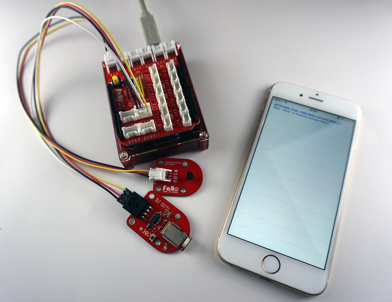

# [Recipe 001] iBeaconで温度を飛ばしiPhoneアプリで受信する

# 本レシピについて

本レシピは、FaBo Arduinoで温度センサーの値をiBeaconで飛ばし、Swiftアプリで受信して表示するためのレシピです。


## レシピの基礎マテリアル

* Arduino
* [[FaBo Docs]#501 Shield Outin Arduino](http://docs.fabo.io/fabo/arduino/outin/501_shield_outin_arduino.html)
* [[FaBo Docs]#108 FaBo Temperature](http://docs.fabo.io/fabo/arduino/brick_analog/108_brick_analog_temperature.html)
* [[FaBo Docs]#307 FaBo Nordic BLE](http://docs.fabo.io/fabo/arduino/brick_serial/307_brick_serial_nordic.html)
* [[Swift Docs]iBeaconをモニタリングする](http://docs.fabo.io/swift/corelocation/003_ibeacon_monitaring.html)

## 本レシピで使用するハードウェア


* [Arduino](https://www.arduino.cc/)
* [#501 Shield Outin Arduino](http://www.fabo.io/501.html)
* [#108 FaBo Temperature](http://www.fabo.io/108.html)
* [#307 FaBo Nordic BLE](http://www.fabo.io/307.html])
* iPhone

# [手順1] FaBoで温度を取得

## Arduinoのインストール

Arduinoのページにアクセスし、Arduinoをインストールする。

https://www.arduino.cc/en/Main/Software


## Arduinoの実行

Arduinoのアイコンをクリックし、Arduinoを実行します。


## LEDを点灯

Arduinoのメニューから[ファイル]-[スケッチの例]-[01.Basics]-[Blink]を選択します。


```c
/*
  Blink
  Turns on an LED on for one second, then off for one second, repeatedly.

  Most Arduinos have an on-board LED you can control. On the Uno and
  Leonardo, it is attached to digital pin 13. If you're unsure what
  pin the on-board LED is connected to on your Arduino model, check
  the documentation at http://www.arduino.cc

  This example code is in the public domain.

  modified 8 May 2014
  by Scott Fitzgerald
 */


// the setup function runs once when you press reset or power the board
void setup() {
  // initialize digital pin 13 as an output.
  pinMode(13, OUTPUT);
}

// the loop function runs over and over again forever
void loop() {
  digitalWrite(13, HIGH);   // turn the LED on (HIGH is the voltage level)
  delay(1000);              // wait for a second
  digitalWrite(13, LOW);    // turn the LED off by making the voltage LOW
  delay(1000);              // wait for a second
}
```

Arduinoに実行ファイルを転送するために、[ツール]-[ボード:*]-[Arduino/Genuino Uno]を選びます。
Arduino/Geduino Uno以外のボードを使用する場合は、そのボード名を選択します。


また、USBで転送するためにシリアルポートを設定します。Macの場合は、/dev/cu.usbmodem**** と表記されているポートを選び、Windowsの場合は、ポート*を選びます。


# [手順2] 温度を測る

## 温度を測るコードを作成する


```c
//
// FaBo Brick Sample
//
// #108 Temperature Brick
//
#define tempPin A0 // 温度センサーピン

int tempValue = 0; // 温度取得用

void setup() {
  // 温度センサーピンを入力用に設定
  pinMode(tempPin, INPUT); 

  // シリアル開始 転送レート：9600bps
  Serial.begin(9600);
}

void loop() {
  // センサーより値を取得(0〜1023)
  tempValue = analogRead(tempPin);

  // 取得した値を電圧に変換 (0〜5000mV)
  tempValue = map(tempValue, 0, 1023, 0, 5000);

  // 変換した電圧を300〜1600の値に変換後、温度に変換 (−30〜100度)
  tempValue = map(tempValue, 300, 1600, -30, 100);

  // 算出した温度を出力
  Serial.println(tempValue);

  delay(100);
}
```

Buildし、実機転送します。


Arduinoのメニューから[ツール]-[シリアルプロッタ]を選択します。


温度の変化をチェックします。


# [手順3] BLE BrickでiBeaconをアドバタイジング


```c
//
// FaBo BLE Brick
//
// brick_serial_ble
//
#include <SoftwareSerial.h>
#include <fabo-nordic.h>

SoftwareSerial serial(12, 13);
FaboBLE faboBLE(serial);

// Beaconデータ作成
void makeBeaconData(byte *uuid, int16_t major, int16_t minor, int8_t pow) {
  byte data[30] = {0};
  byte header[] = {0x02, 0x01, 0x06, 0x1A, 0xFF, 0x4C, 0x00, 0x02, 0x15};
  memcpy(&data[0], &header[0], 9);
  memcpy(&data[9], uuid, 16);
  int16_t swapped_major = (major>>8) | (major<<8);
  memcpy(&data[25], &swapped_major, 2);
  int16_t swapped_minor = (minor>>8) | (minor<<8);
  memcpy(&data[27], &swapped_minor, 2);
  memcpy(&data[29], &pow, 1);
  // Advデータ設定
  faboBLE.setAdvData(data, 30);
}

// 初期化完了イベント
void onReady(FaboBLE::VersionInfo ver, int8_t error)
{
  Serial.println(F("\n*onReady"));
  Serial.print(F("CompanyID: "));
  Serial.println(ver.companyID, HEX);
  Serial.print(F("FirmwareID: "));
  Serial.println(ver.firmwareID, HEX);
  Serial.print(F("LMPVersion: "));
  Serial.println(ver.lmp);
  Serial.print(F("Error: "));
  Serial.println(error, HEX);
  // Beaconデータ作成
  byte uuid[] = {0x00, 0x01, 0x02, 0x03, 0x04, 0x05, 0x06, 0x07, 0x08, 0x09, 0x0a, 0x0b, 0x0c, 0x0d, 0x0e, 0x0f};
  makeBeaconData(uuid, 100, 1000, 0xC9);
}

// Advデータ設定イベント
void onSetAdvData(int8_t error)
{
  Serial.println(F("\n*onSetAdvData"));
  Serial.print(F("Error: "));
  Serial.println(error, HEX);
  // アドバタイズ開始
  faboBLE.startAdvertise();
}

void setup()
{
  Serial.begin(9600);

  // Debugモードでログが詳細に表示されます
  faboBLE.setDebug();
  // イベントハンドラ登録
  faboBLE.onReady = onReady;
  faboBLE.onSetAdvData = onSetAdvData;
  // 初期化
  faboBLE.init();
}

void loop()
{
  // BLE内部処理のためloop内で呼び出してください
  faboBLE.tick();
}
```


# [手順4] iBeaconのMinorに温度を乗せてアドバタイジング


UUIDを下記の値に設定します。

> 9EDFA660-204E-4066-8644-A432AE2B6EC2


```c
//
// FaBo BLE Brick
//
// brick_serial_ble
//
#include <SoftwareSerial.h>
#include <fabo-nordic.h>

#define USER_ID 1 // ユーザ別に変える
#define tempPin A0 // 温度センサーピン
int tempValue = 0; // 温度取得用
// 9EDFA660-204E-4066-8644-A432AE2B6EC2
byte UUID[] = {0x9E, 0xDF, 0xA6, 0x60,  0x20, 0x4E, 0x40, 0x66, 0x86, 0x44, 0xA4, 0x32, 0xAE, 0x2B, 0x6E, 0xEC1};
SoftwareSerial serial(12, 13);
FaboBLE faboBLE(serial);

// Beaconデータ作成
void makeBeaconData(byte *uuid, int16_t major, int16_t minor, int8_t pow) {
  byte data[30] = {0};
  byte header[] = {0x02, 0x01, 0x06, 0x1A, 0xFF, 0x4C, 0x00, 0x02, 0x15};
  memcpy(&data[0], &header[0], 9);
  memcpy(&data[9], uuid, 16);
  int16_t swapped_major = (major>>8) | (major<<8);
  memcpy(&data[25], &swapped_major, 2);
  int16_t swapped_minor = (minor>>8) | (minor<<8);
  memcpy(&data[27], &swapped_minor, 2);
  memcpy(&data[29], &pow, 1);
  // Advデータ設定
  faboBLE.setAdvData(data, 30);
}

// 初期化完了イベント
void onReady(FaboBLE::VersionInfo ver, int8_t error)
{
  Serial.println(F("\n*onReady"));
  Serial.print(F("CompanyID: "));
  Serial.println(ver.companyID, HEX);
  Serial.print(F("FirmwareID: "));
  Serial.println(ver.firmwareID, HEX);
  Serial.print(F("LMPVersion: "));
  Serial.println(ver.lmp);
  Serial.print(F("Error: "));
  Serial.println(error, HEX);
  // Beaconデータ作成
  makeBeaconData(UUID, USER_ID, 0, 0xC9);
}

// Advデータ設定イベント
void onSetAdvData(int8_t error)
{
  Serial.println(F("\n*onSetAdvData"));
  Serial.print(F("Error: "));
  Serial.println(error, HEX);
  // アドバタイズ開始
  faboBLE.startAdvertise();
}

void setup()
{
  Serial.begin(9600);

  // 温度センサーピンを入力用に設定
  pinMode(tempPin, INPUT);
  
  // Debugモードでログが詳細に表示されます
  faboBLE.setDebug();
  // イベントハンドラ登録
  faboBLE.onReady = onReady;
  faboBLE.onSetAdvData = onSetAdvData;
  // 初期化
  faboBLE.init();
}

int i = 0;
void loop()
{

  // 100ms*10=1(s)ごとに温度を計測
  if (i > 10) {
    // センサーより値を取得(0〜1023)
    tempValue = analogRead(tempPin);

    // 取得した値を電圧に変換 (0〜5000mV)
    tempValue = map(tempValue, 0, 1023, 0, 5000);

    // 変換した電圧を300〜1600の値に変換後、温度に変換 (−30〜100度)
    tempValue = map(tempValue, 300, 1600, -30, 100);

    // Beaconデータ作成
    makeBeaconData(UUID, USER_ID, tempValue, 0xC9);
    i = 0;
  }
  i++;
  
  // BLE内部処理のためloop内で呼び出してください
  faboBLE.tick();

  // 100ms delay
  delay(100);
}
```

# Swiftアプリで受信

## Swift Docsのサンプルで受信データを確認してみる

[[Swift Docs] iBeaconでモニタリング](http://docs.fabo.io/swift/corelocation/003_ibeacon_monitaring.html)　で、サンプルを実行し、値を確認してみる。





## MajorID 1を温度の情報と認識し、MinorIDを温度に反映させる

## Swift 3.0

```json
<key>NSLocationAlwaysUsageDescription</key>
<string>位置情報の取得を、常に許可しますか？</string>
```

プログラムの変更点
```swift
        // セキュリティ認証のステータスを取得.
        let status = CLLocationManager.authorizationStatus()
        print("authorizationStatus:\(status)");
   
        // まだ認証が得られていない場合は、認証ダイアログを表示
        // (このAppの使用中のみ許可の設定)
        if(status == notDetermined) {
           self.myLocationManager.requestAlwaysAuthorization()
        }

```

```swift
//
//
//  ViewController.swift
//  Recipe 001
//
//  Copyright © 2016年 FaBo, Inc. All rights reserved.
//

import UIKit
import CoreLocation
import AudioToolbox

class ViewController: UIViewController, CLLocationManagerDelegate {
    
    var myLocationManager:CLLocationManager!
    var myBeaconRegion:CLBeaconRegion!
    var beaconUuids: NSMutableArray!
    var beaconDetails: NSMutableArray!
    var myLabel: UILabel!
    
    // 今回の検知対象は3つのUUID。(OS等のバージョンで検出可能な上限数は20個程度が目安)
    let UUIDList = [
        "9EDFA660-204E-4066-8644-A432AE2B6EC1"
    ]
    
    override func viewDidLoad() {
        super.viewDidLoad()
        
        // UILabel.
        
        // ボタンの生成.
        let buttonWidth: CGFloat = 200
        let buttonHeight: CGFloat = 200
        let posX: CGFloat = (self.view.bounds.width - buttonWidth)/2
        let posY: CGFloat = (self.view.bounds.height - buttonWidth)/2
        myLabel = UILabel(frame: CGRect(x: posX, y: posY, width: buttonWidth, height: buttonHeight))
        myLabel.backgroundColor = UIColor.orange
        myLabel.layer.masksToBounds = true
        myLabel.layer.cornerRadius = 100.0
        myLabel.text = "N/D"
        myLabel.textAlignment = .center
        myLabel.textColor = UIColor.white
        myLabel.font = UIFont.systemFont(ofSize: CGFloat(50))
        self.view.addSubview(myLabel)
        
        // ロケーションマネージャの作成.
        myLocationManager = CLLocationManager()
        
        // デリゲートを自身に設定.
        myLocationManager.delegate = self
        
        // セキュリティ認証のステータスを取得
        let status = CLLocationManager.authorizationStatus()
        print("CLAuthorizedStatus: \(status)");
        
        // まだ認証が得られていない場合は、認証ダイアログを表示
        if(status == .notDetermined) {
            // [認証手順1] まだ承認が得られていない場合は、認証ダイアログを表示.
            // [認証手順2] が呼び出される
            myLocationManager.requestAlwaysAuthorization()
        }
    }
    
    /*
     CoreLocationの利用許可が取れたらiBeaconの検出を開始する.
     */
    private func startMyMonitoring() {
        
        // UUIDListのUUIDを設定して、反応するようにする
        for i in 0 ..< UUIDList.count {
            
            // BeaconのUUIDを設定.
            let uuid: NSUUID! = NSUUID(uuidString: "\(UUIDList[i].lowercased())")
            
            // BeaconのIfentifierを設定.
            let identifierStr: String = "fabo\(i)"
            
            // リージョンを作成.
            myBeaconRegion = CLBeaconRegion(proximityUUID: uuid as UUID, identifier: identifierStr)
            
            // ディスプレイがOffでもイベントが通知されるように設定(trueにするとディスプレイがOnの時だけ反応).
            myBeaconRegion.notifyEntryStateOnDisplay = false
            
            // 入域通知の設定.
            myBeaconRegion.notifyOnEntry = true
            
            // 退域通知の設定.
            myBeaconRegion.notifyOnExit = true
            
            // [iBeacon 手順1] iBeaconのモニタリング開始([iBeacon 手順2]がDelegateで呼び出される).
            myLocationManager.startMonitoring(for: myBeaconRegion)
        }
    }
    
    /*
     [認証手順2] 認証のステータスがかわったら呼び出される.
     */
    func locationManager(_ manager: CLLocationManager, didChangeAuthorization status: CLAuthorizationStatus) {
        
        print("didChangeAuthorizationStatus");
        
        // 認証のステータスをログで表示
        switch (status) {
        case .notDetermined:
            print("未認証の状態")
            break
        case .restricted:
            print("制限された状態")
            break
        case .denied:
            print("許可しない")
            break
        case .authorizedAlways:
            print("常に許可")
            // 許可がある場合はiBeacon検出を開始.
            startMyMonitoring()
            break
        case .authorizedWhenInUse:
            print("このAppの使用中のみ許可")
            // 許可がある場合はiBeacon検出を開始.
            startMyMonitoring()
            break
        }
    }
    
    /*
     [iBeacon 手順2]  startMyMonitoring()内のでstartMonitoringForRegionが正常に開始されると呼び出される。
     */
    func locationManager(_ manager: CLLocationManager, didStartMonitoringFor region: CLRegion) {
        
        print("[iBeacon 手順2] didStartMonitoringForRegion");
        
        // [iBeacon 手順3] この時点でビーコンがすでにRegion内に入っている可能性があるので、その問い合わせを行う
        // [iBeacon 手順4] がDelegateで呼び出される.
        manager.requestState(for: region);
    }
    
    /*
     [iBeacon 手順4] 現在リージョン内にiBeaconが存在するかどうかの通知を受け取る.
     */
    func locationManager(_ manager: CLLocationManager, didDetermineState state: CLRegionState, for region: CLRegion) {
        
        print("[iBeacon 手順4] locationManager: didDetermineState \(state)")
        
        switch (state) {
            
        case .inside: // リージョン内にiBeaconが存在いる
            print("iBeaconが存在!");
            
            // [iBeacon 手順5] すでに入っている場合は、そのままiBeaconのRangingをスタートさせる。
            // [iBeacon 手順6] がDelegateで呼び出される.
            // iBeaconがなくなったら、Rangingを停止する
            manager.startRangingBeacons(in: region as! CLBeaconRegion)
            break;
            
        case .outside:
            print("iBeaconが圏外!")
            // 外にいる、またはUknownの場合はdidEnterRegionが適切な範囲内に入った時に呼ばれるため処理なし。
            break;
            
        case .unknown:
            print("iBeaconが圏外もしくは不明な状態!")
            // 外にいる、またはUknownの場合はdidEnterRegionが適切な範囲内に入った時に呼ばれるため処理なし。
            break;
            
        }
    }
    
    /*
     [iBeacon 手順6] 現在取得しているiBeacon情報一覧が取得できる.
     iBeaconを検出していなくても1秒ごとに呼ばれる.
     */
    func locationManager(_ manager: CLLocationManager, didRangeBeacons beacons: [CLBeacon], in region: CLBeaconRegion) {
        
        // 範囲内で検知されたビーコンはこのbeaconsにCLBeaconオブジェクトとして格納される
        // rangingが開始されると１秒毎に呼ばれるため、beaconがある場合のみ処理をするようにすること.
        if(beacons.count > 0){
            
            // STEP7: 発見したBeaconの数だけLoopをまわす
            for i in 0 ..< beacons.count {
                
                let beacon = beacons[i]
                
                let beaconUUID = beacon.proximityUUID;
                let minorID = beacon.minor;
                let majorID = beacon.major;
                let rssi = beacon.rssi;
                
                
                var proximity = ""
                
                switch (beacon.proximity) {
                    
                case CLProximity.unknown :
                    print("Proximity: Unknown");
                    proximity = "Unknown"
                    break
                    
                case CLProximity.far:
                    print("Proximity: Far");
                    proximity = "Far"
                    break
                    
                case CLProximity.near:
                    print("Proximity: Near");
                    proximity = "Near"
                    break
                    
                case CLProximity.immediate:
                    print("Proximity: Immediate");
                    proximity = "Immediate"
                    break
                }
                
                // majorIDが1の場合は、温度を乗せたBeacon情報
                if(majorID == 1) {
                    myLabel.text = "\(minorID)℃"
                    myLabel.reloadInputViews()
                }
            }
        }
    }
    
    /*
     [iBeacon イベント] iBeaconを検出した際に呼ばれる.
     */
    func locationManager(_ manager: CLLocationManager, didEnterRegion region: CLRegion) {
        print("didEnterRegion: iBeaconが圏内に発見されました。");
        
        // Rangingを始める (Ranginghあ1秒ごとに呼ばれるので、検出中のiBeaconがなくなったら止める)
        manager.startRangingBeacons(in: region as! CLBeaconRegion)
        
    }
    
    /*
     [iBeacon イベント] iBeaconを喪失した際に呼ばれる. 喪失後 15-30秒ぐらいあとに呼び出される.
     */
    func locationManager(_ manager: CLLocationManager, didExitRegion region: CLRegion) {
        print("didExitRegion: iBeaconが圏外に喪失されました。");
        
        // 検出中のiBeaconが存在しないのなら、iBeaconのモニタリングを終了する.
        if(beaconUuids.count == 0) {
            manager.stopRangingBeacons(in: region as! CLBeaconRegion)
        }
    }
    
}
```


### Swift 2.3

info.plist

```json
<key>NSLocationAlwaysUsageDescription</key>
<string>位置情報の取得を、常に許可しますか？</string>
```

プログラムの変更点
```swift
        // セキュリティ認証のステータスを取得.
        let status = CLLocationManager.authorizationStatus()
        print("authorizationStatus:\(status)");
   
        // まだ認証が得られていない場合は、認証ダイアログを表示
        // (このAppの使用中のみ許可の設定)
        if(status == notDetermined) {
           self.myLocationManager.requestAlwaysAuthorization()
        }

```


```swift
//
//
//  ViewController.swift
//  Recipe 001
//
//  Copyright © 2016年 FaBo, Inc. All rights reserved.
//

import UIKit
import CoreLocation
import AudioToolbox

class ViewController: UIViewController, CLLocationManagerDelegate {
    
    var myLocationManager:CLLocationManager!
    var myBeaconRegion:CLBeaconRegion!
    var beaconUuids: NSMutableArray!
    var beaconDetails: NSMutableArray!
    var myLabel: UILabel!

    // 今回の検知対象は3つのUUID。(OS等のバージョンで検出可能な上限数は20個程度が目安)
    let UUIDList = [
        "9EDFA660-204E-4066-8644-A432AE2B6EC1"
        ]
    
    override func viewDidLoad() {
        super.viewDidLoad()
        
        // UILabel.
        
        // ボタンの生成.
        let buttonWidth: CGFloat = 200
        let buttonHeight: CGFloat = 200
        let posX: CGFloat = (self.view.bounds.width - buttonWidth)/2
        let posY: CGFloat = (self.view.bounds.height - buttonWidth)/2
        myLabel = UILabel(frame: CGRect(x: posX, y: posY, width: buttonWidth, height: buttonHeight))
        myLabel.backgroundColor = UIColor.orangeColor()
        myLabel.layer.masksToBounds = true
        myLabel.layer.cornerRadius = 100.0
        myLabel.text = "N/D"
        myLabel.textAlignment = .Center
        myLabel.textColor = UIColor.whiteColor()
        myLabel.font = UIFont.systemFontOfSize(CGFloat(50))
        self.view.addSubview(myLabel)
        
        // ロケーションマネージャの作成.
        myLocationManager = CLLocationManager()
        
        // デリゲートを自身に設定.
        myLocationManager.delegate = self
        
        // セキュリティ認証のステータスを取得
        let status = CLLocationManager.authorizationStatus()
        print("CLAuthorizedStatus: \(status)");

        // まだ認証が得られていない場合は、認証ダイアログを表示
        if(status == .NotDetermined) {
            // [認証手順1] まだ承認が得られていない場合は、認証ダイアログを表示.
            // [認証手順2] が呼び出される
            myLocationManager.requestAlwaysAuthorization()
        }
    }
    
    /*
     CoreLocationの利用許可が取れたらiBeaconの検出を開始する.
    */
    private func startMyMonitoring() {
        
        // UUIDListのUUIDを設定して、反応するようにする
        for i in 0 ..< UUIDList.count {
            
            // BeaconのUUIDを設定.
            let uuid: NSUUID! = NSUUID(UUIDString: "\(UUIDList[i].lowercaseString)")

            // BeaconのIfentifierを設定.
            let identifierStr: String = "fabo\(i)"
            
            // リージョンを作成.
            myBeaconRegion = CLBeaconRegion(proximityUUID: uuid, identifier: identifierStr)
            
            // ディスプレイがOffでもイベントが通知されるように設定(trueにするとディスプレイがOnの時だけ反応).
            myBeaconRegion.notifyEntryStateOnDisplay = false
            
            // 入域通知の設定.
            myBeaconRegion.notifyOnEntry = true
            
            // 退域通知の設定.
            myBeaconRegion.notifyOnExit = true
            
            // [iBeacon 手順1] iBeaconのモニタリング開始([iBeacon 手順2]がDelegateで呼び出される).
            myLocationManager.startMonitoringForRegion(myBeaconRegion)
        }
    }
    
    /*
      [認証手順2] 認証のステータスがかわったら呼び出される.
     */
    func locationManager(manager: CLLocationManager, didChangeAuthorizationStatus status: CLAuthorizationStatus) {
        
        print("didChangeAuthorizationStatus");
        
        // 認証のステータスをログで表示
        switch (status) {
        case .NotDetermined:
            print("未認証の状態")
            break
        case .Restricted:
            print("制限された状態")
            break
        case .Denied:
            print("許可しない")
            break
        case .AuthorizedAlways:
            print("常に許可")
            // 許可がある場合はiBeacon検出を開始.
            startMyMonitoring()
            break
        case .AuthorizedWhenInUse:
            print("このAppの使用中のみ許可")
            // 許可がある場合はiBeacon検出を開始.
            startMyMonitoring()
            break
        }
    }
    
    /*
     [iBeacon 手順2]  startMyMonitoring()内のでstartMonitoringForRegionが正常に開始されると呼び出される。
     */
    func locationManager(manager: CLLocationManager, didStartMonitoringForRegion region: CLRegion) {
        
        print("[iBeacon 手順2] didStartMonitoringForRegion");
        
        // [iBeacon 手順3] この時点でビーコンがすでにRegion内に入っている可能性があるので、その問い合わせを行う
        // [iBeacon 手順4] がDelegateで呼び出される.
        manager.requestStateForRegion(region);
    }
    
    /*
     [iBeacon 手順4] 現在リージョン内にiBeaconが存在するかどうかの通知を受け取る.
     */
    func locationManager(manager: CLLocationManager, didDetermineState state: CLRegionState, forRegion region: CLRegion) {
        
        print("[iBeacon 手順4] locationManager: didDetermineState \(state)")
        
        switch (state) {
            
        case .Inside: // リージョン内にiBeaconが存在いる
            print("iBeaconが存在!");
            
            // [iBeacon 手順5] すでに入っている場合は、そのままiBeaconのRangingをスタートさせる。
            // [iBeacon 手順6] がDelegateで呼び出される.
            // iBeaconがなくなったら、Rangingを停止する
            manager.startRangingBeaconsInRegion(region as! CLBeaconRegion)
            break;
            
        case .Outside:
            print("iBeaconが圏外!")
            // 外にいる、またはUknownの場合はdidEnterRegionが適切な範囲内に入った時に呼ばれるため処理なし。
            break;
            
        case .Unknown:
            print("iBeaconが圏外もしくは不明な状態!")
            // 外にいる、またはUknownの場合はdidEnterRegionが適切な範囲内に入った時に呼ばれるため処理なし。
            break;
            
        }
    }
    
    /*
     [iBeacon 手順6] 現在取得しているiBeacon情報一覧が取得できる.
     iBeaconを検出していなくても1秒ごとに呼ばれる.
     */
    func locationManager(manager: CLLocationManager, didRangeBeacons beacons: [CLBeacon], inRegion region: CLBeaconRegion) {
        
        // 範囲内で検知されたビーコンはこのbeaconsにCLBeaconオブジェクトとして格納される
        // rangingが開始されると１秒毎に呼ばれるため、beaconがある場合のみ処理をするようにすること.
        if(beacons.count > 0){
            
            // STEP7: 発見したBeaconの数だけLoopをまわす
            for i in 0 ..< beacons.count {
                
                let beacon = beacons[i]
                
                let beaconUUID = beacon.proximityUUID;
                let minorID = beacon.minor;
                let majorID = beacon.major;
                let rssi = beacon.rssi;
                
        
                var proximity = ""
                
                switch (beacon.proximity) {
                    
                case CLProximity.Unknown :
                    print("Proximity: Unknown");
                    proximity = "Unknown"
                    break
                    
                case CLProximity.Far:
                    print("Proximity: Far");
                    proximity = "Far"
                    break
                    
                case CLProximity.Near:
                    print("Proximity: Near");
                    proximity = "Near"
                    break
                    
                case CLProximity.Immediate:
                    print("Proximity: Immediate");
                    proximity = "Immediate"
                    break
                }
                
                // majorIDが1の場合は、温度を乗せたBeacon情報
                if(majorID == 1) {
                    myLabel.text = "\(minorID)℃"
                    myLabel.reloadInputViews()
                }
            }
        }
    }
    
    /*
     [iBeacon イベント] iBeaconを検出した際に呼ばれる.
     */
    func locationManager(manager: CLLocationManager, didEnterRegion region: CLRegion) {
        print("didEnterRegion: iBeaconが圏内に発見されました。");
        
        // Rangingを始める (Ranginghあ1秒ごとに呼ばれるので、検出中のiBeaconがなくなったら止める)
        manager.startRangingBeaconsInRegion(region as! CLBeaconRegion)
        
    }
    
    /*
     [iBeacon イベント] iBeaconを喪失した際に呼ばれる. 喪失後 15-30秒ぐらいあとに呼び出される.
     */
    func locationManager(manager: CLLocationManager, didExitRegion region: CLRegion) {
        print("didExitRegion: iBeaconが圏外に喪失されました。");
        
        // 検出中のiBeaconが存在しないのなら、iBeaconのモニタリングを終了する.
        if(beaconUuids.count == 0) {
            manager.stopRangingBeaconsInRegion(region as! CLBeaconRegion)
        }
    }
    
}
```